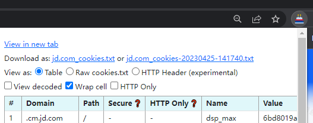

# Predict_AudienceSize

### 关于京东数坊人数计算API接口的调用

#### Step1 ：插件下载，直接获取cookies

#### Step2： 根据相关业务填写data_sheet.xlsx表

> 其中**人群名称、运算规则、卡片名称**为必填单元格，同一个人群包（不得超过30个卡片）的`人群名称`需保持一致，命名规则根据个人可改变，无影响；若人群包中只有一个卡片，运算规则需填写“空”字，不可省略不填
> 
**目前支持的维度（持续更新中……）**
- 浏览行为_品牌/类目
> **`get_view_data(brand_id, cate_id, start_time, end_time, frequency, price)`** 
> 固定维度为品牌x三级类目、品牌、三级类目维度，根据需求在data_sheet中填写相关的数据
- 浏览行为_店铺
>**`get_view1_data(shop_id,start_time, end_time, frequency, price)`** 
>固定维度为店铺内商品维度，此时的Key_ID不是写品牌ID，而是店铺ID
- 购买行为_品牌/类目
> **`get_order_data(brand_id, cate_id, start_time, end_time, frequency, price)`** 
> 固定维度为品牌x三级类目、品牌、三级类目维度，根据需求在data_sheet中填写相关的数据
- 购买行为_店铺
>**`get_order1_data(shop_id,start_time, end_time, frequency, price)`** 
>固定维度为店铺内商品维度，此时的Key_ID不是写品牌ID，而是店铺ID
- 购买行为_关键词x三级类目
> **`get_order2_data(shop_id,cate_id,keyWords,start_time, end_time, frequency, price)`** 
>固定维度为关键词x三级类目，此时的Key_ID不填写，需填写KeyWords（）关键词和类目
- 购买行为_SKU
>
- 已有人群
>**`get_old_data(cookies,name)`**
> 已有人群除必填信息外，其他信息信息无需填写，只需要讲已有人群包的人群包名称填写到`已有人群`列
> 这里需要注意，人群包名称必须和之前创建的人群包名称一致，不可省略。

#### Step3： 生成的表在output文件夹中的output.xlsx中

